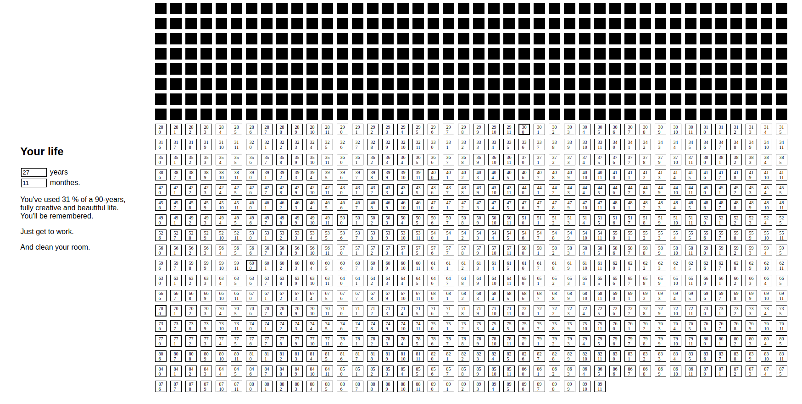

# Memento mori

Life calendar: monthes in a 90 years long life. 
Bigger borders mark the end of a decade.

So, **how many monthes have you lived ? What have you achieved ?**




## Launch

```
$ npm i
$ npm run serve
```
## Build (generate static files)

```
$ npm run build (or build:dev)
# the public/ folder will be populated
```